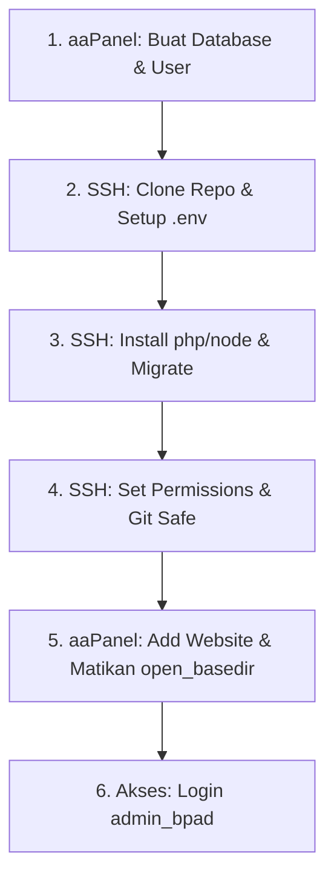

# Panduan Lengkap Setup & Deploy Website TLD-BPAD dari Awal
Dokumentasi ini berisi panduan langkah-demi-langkah berdasarkan konfigurasi aktual di server staging **http://tld.bpadntt.cloud** (IP: `212.85.26.65`).

---

## DAFTAR ALUR DEPLOYMENT


---

## TAHAP 1: Persiapan Database di aaPanel

1. Buka dashboard **aaPanel** Anda.
2. Pergi ke menu **Databases** di panel sebelah kiri.
3. Klik tombol **Add Database**, isi data berikut:
   * **Database Name**: `TLD-BPAD`
   * **Username**: `tld_bpad`
   * **Password**: `tldbpadntt`
   * **Access Permission**: `Localhost` (lebih aman karena web server & database berada di VPS yang sama).
4. Klik **Submit**.

---

## TAHAP 2: Clone Repository & Setup Environment (.env)

1. Hubungkan ke VPS menggunakan SSH dari komputer lokal Anda:
   ```bash
   ssh root@212.85.26.65
   ```
2. Masuk ke direktori web root server dan clone repositori Anda ke dalam folder `tld-bpad`:
   ```bash
   cd /www/wwwroot
   # Pastikan tidak ada sisa folder lama
   rm -rf tld-bpad
   # Clone repository resmi Anda
   git clone https://github.com/pdebpadprovntt/tld-bpadntt.git tld-bpad
   cd tld-bpad
   ```
3. Buat file `.env` baru menggunakan perintah `cat` di bawah ini (salin seluruh kode di bawah dan jalankan di terminal VPS):
   ```bash
   cat << 'EOF' > .env
   APP_NAME=Laravel
   APP_ENV=production
   APP_KEY=base64:JzdJ0g3DRrQIBQClm51HpjX3urKSNBQGe9tqR3q11Uk=
   APP_DEBUG=false
   APP_URL=http://tld.bpadntt.cloud

   APP_LOCALE=id
   APP_FALLBACK_LOCALE=id
   APP_FAKER_LOCALE=id_ID

   APP_MAINTENANCE_DRIVER=file

   BCRYPT_ROUNDS=12

   LOG_CHANNEL=stack
   LOG_STACK=single
   LOG_DEPRECATIONS_CHANNEL=null
   LOG_LEVEL=warning

   DB_CONNECTION=mysql
   DB_HOST=127.0.0.1
   DB_PORT=3306
   DB_DATABASE=TLD-BPAD
   DB_USERNAME=tld_bpad
   DB_PASSWORD=tldbpadntt

   SESSION_DRIVER=database
   SESSION_LIFETIME=120
   SESSION_ENCRYPT=false
   SESSION_PATH=/
   SESSION_DOMAIN=null

   BROADCAST_CONNECTION=log
   FILESYSTEM_DISK=local
   QUEUE_CONNECTION=database

   CACHE_STORE=database

   MEMCACHED_HOST=127.0.0.1

   REDIS_CLIENT=phpredis
   REDIS_HOST=127.0.0.1
   REDIS_PASSWORD=null
   REDIS_PORT=6379

   MAIL_MAILER=log
   MAIL_SCHEME=null
   MAIL_HOST=127.0.0.1
   MAIL_PORT=2525
   MAIL_USERNAME=null
   MAIL_PASSWORD=null
   MAIL_FROM_ADDRESS="pdebpadntt@gmail.com"
   MAIL_FROM_NAME="${APP_NAME}"

   AWS_ACCESS_KEY_ID=
   AWS_SECRET_ACCESS_KEY=
   AWS_DEFAULT_REGION=us-east-1
   AWS_BUCKET=
   AWS_USE_PATH_STYLE_ENDPOINT=false

   VITE_APP_NAME="${APP_NAME}"
   EOF
   ```

---

## TAHAP 3: Instalasi Dependency & Migrasi Database

Jalankan rangkaian perintah berikut untuk menginstal paket-paket PHP/Node.js, melakukan migrasi tabel database, serta membuat user admin default:

```bash
# 1. Daftarkan direktori project sebagai direktori aman di Git VPS
git config --global --add safe.directory /www/wwwroot/tld-bpad

# 2. Hapus file cache konfigurasi Laravel lama (jika ada)
rm -f bootstrap/cache/*.php

# 3. Install dependency PHP (Composer)
composer install --optimize-autoloader --no-dev

# 4. Hubungkan folder storage ke folder public agar file upload dapat diakses
php artisan storage:link

# 5. Jalankan migrasi tabel database
php artisan migrate --force

# 6. Buat user admin default bawaan sistem
php artisan db:seed

# 7. Install dan compile front-end assets (Vite)
npm install
npm run build
```

> **Informasi User Admin Bawaan (Hasil Seeder)**:
> * **Username / NIP**: `admin_bpad`
> * **Password**: `Admin@BPAD2025`

---

## TAHAP 4: Pengaturan Hak Akses & Cache Optimasi

1. Berikan kepemilikan folder yang sesuai kepada user server web (`www`) agar tidak terjadi error izin penulisan log / file:
   ```bash
   chown -R www:www /www/wwwroot/tld-bpad
   chmod -R 755 /www/wwwroot/tld-bpad
   chmod -R 775 /www/wwwroot/tld-bpad/storage
   chmod -R 775 /www/wwwroot/tld-bpad/bootstrap/cache
   ```
2. Jalankan kompilasi cache konfigurasi Laravel:
   ```bash
   php artisan config:cache
   php artisan route:cache
   ```

---

## TAHAP 5: Konfigurasi Website di aaPanel

1. Di dashboard **aaPanel**, buka menu **Website** -> Klik tombol **Add Site**.
2. Masukkan data konfigurasi berikut:
   * **Domain**: `tld.bpadntt.cloud` (atau domain Anda)
   * **Site Directory**: `/www/wwwroot/tld-bpad`
   * **Running Directory**: Pilih `/public` (kemudian klik **Save**).
3. Klik pada nama website Anda untuk membuka jendela **Settings** (Pengaturan):
   * **Menonaktifkan open_basedir (CRITICAL)**: Buka tab **Site directory**, hilangkan tanda centang pada pilihan **"Anti-XSS attack (Base directory limit)(open_basedir)"**, lalu klik **Save**.
   * **URL Rewrite Laravel**: Buka tab **URL Rewrite**, pilih template **laravel** dari daftar dropdown (atau paste kode di bawah ini), kemudian klik **Save**:
     ```nginx
     location / {
         try_files $uri $uri/ /index.php?$query_string;
     }
     ```
4. Pergi ke **App Store** di aaPanel, lalu **Restart** service **PHP** dan **Nginx** Anda untuk menerapkan semua konfigurasi.

---

## TAHAP 6: Alur Kerja Pembaruan Kode (Workflow Update)

Setiap kali Anda mengubah kode proyek di komputer lokal (development) dan ingin melakukan update ke hosting produksi/staging, ikuti alur berikut:

### Di Laptop Lokal Anda:
```bash
# 1. Tambah file, commit, dan push ke GitHub
git add .
git commit -m "Deskripsi perubahan Anda"
git push origin main
```

### Di Terminal SSH Server VPS:
```bash
# 1. Hubungkan ke SSH
ssh root@212.85.26.65

# 2. Masuk ke folder web
cd /www/wwwroot/tld-bpad

# 3. Bersihkan file lokal jika ada bentrok file saat pull
git reset --hard

# 4. Tarik kode terbaru dari GitHub
git pull origin main

# 5. Bersihkan cache lama & buat cache baru
php artisan optimize:clear
php artisan config:cache
php artisan route:cache
```